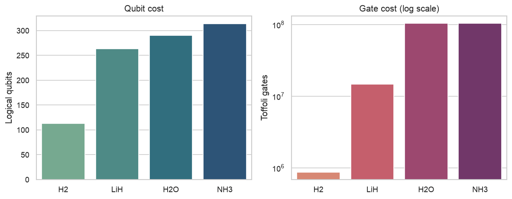
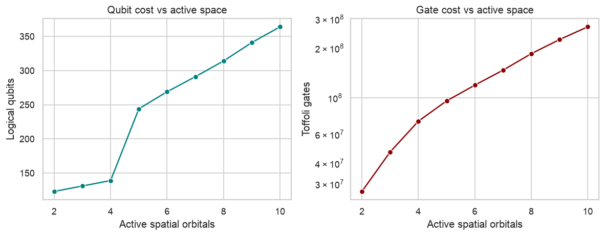

# FaultTolerantQChem

Resource estimation for fault-tolerant quantum simulation of molecular systems.
This repository quantifies how the cost of simulating molecular Hamiltonians via
quantum phase estimation (QPE) — measured in logical qubits and Toffoli gates —
depends on classical electronic-structure choices such as basis set and active-space
size. Hamiltonians are block-encoded using double factorization, and resources are
estimated with PennyLane.

The central theme is the bridge between classical quantum chemistry and
fault-tolerant quantum computing: the same decisions that govern accuracy and cost
in classical multireference methods — orbital count, active space, basis — directly
determine the logical-qubit and gate requirements of the corresponding quantum
algorithm.

## Studies

**Single-molecule resource estimation** (`01_single_molecule_estimate.ipynb`)
Estimates the QPE cost of simulating H₂O under double factorization, reporting the
Hamiltonian 1-norm, Toffoli count, and logical-qubit count. Quantifies how tightening
the target precision raises gate cost (≈10× per decade of error) while leaving qubit
count nearly fixed, and how enlarging the basis from STO-3G to 6-31G increases both
qubit and gate cost.

**Resource scaling across molecules** (`02_resource_scaling.ipynb`)
Maps logical-qubit and Toffoli cost across molecules of increasing size (H₂, LiH,
H₂O, NH₃). Qubit count grows roughly linearly with the number of spin-orbitals, while
Toffoli cost spans nearly three orders of magnitude across the set.

**Resource scaling with active-space size** (`03_active_space_scaling.ipynb`)
Holds the molecule fixed (N₂) and scans the active space from 2 to 10 spatial
orbitals, showing monotonic growth in both qubit and gate cost. This makes explicit
the classical multireference tradeoff — a larger active space captures more
correlation at higher cost — now expressed as fault-tolerant circuit cost.

## Results

Resource cost across molecules (STO-3G, double factorization):

Resource cost vs active-space size (N₂):

Representative figures for H₂O / STO-3G: 1-norm λ ≈ 53.6, ~1.0 × 10⁸ Toffoli gates,
290 logical qubits.

## Scope

These are resource *estimates* for fault-tolerant QPE, not circuit executions. The
active-space scan uses a leading-block truncation of the molecular-orbital integrals
to demonstrate scaling; a physically motivated active space would select orbitals by
energy, occupation, or symmetry rather than by index.

## Setup
